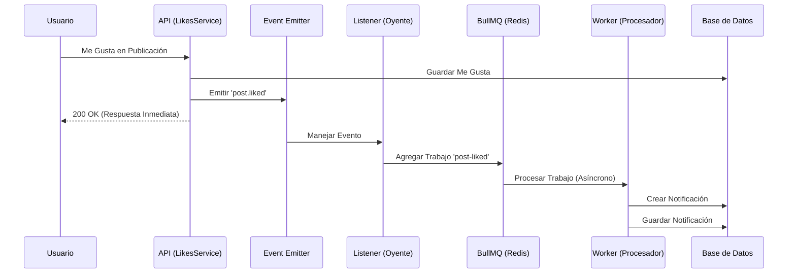

# Debook Interacción de Contenido Social

Una API escalable y de alto rendimiento para interacciones sociales (me gusta) y notificaciones asíncronas, construida con NestJS, PostgreSQL y BullMQ.

## Características

- **Contadores de Alto Rendimiento**: Utiliza contadores desnormalizados en las publicaciones para rendimiento de lectura O(1).
- **Idempotencia**: Previene me gusta duplicados usando restricciones únicas de base de datos y diseño de API idempotente.
- **Notificaciones Asíncronas**: Sistema de notificaciones desacoplado usando BullMQ (Redis) y Event Emitters.
- **Arquitectura Limpia**: Separación estricta de responsabilidades (Controlador -> Servicio -> Repositorio).
- **Dockerizado**: Entornos completos para desarrollo y producción.

## Requisitos Previos

- Node.js 18+
- Docker y Docker Compose

## Inicio Rápido (Docker)

La forma más fácil de ejecutar la aplicación es usando Docker.

1.  **Iniciar Servicios**:
```bash
    # Windows (Git Bash / PowerShell)
    bash start-docker.sh
  
    ./start-docker.ps1
```
    Este script iniciará los contenedores y ejecutará las migraciones de base de datos automáticamente.

2.  **Verificar**:
    La API estará ejecutándose en `http://localhost:3000`.
    Documentación Swagger disponible en `http://localhost:3000/api`.

## Desarrollo Local (Configuración Manual)

Si prefieres ejecutar Node.js localmente:

1.  **Iniciar Base de Datos y Redis**:
```bash
    docker compose up -d postgres redis
```

2.  **Instalar Dependencias**:
```bash
    npm install
```

3.  **Ejecutar Migraciones**:
```bash
    npm run db:create    # Asegurar que la BD existe
    npm run migration:run
```

4.  **Iniciar Aplicación**:
```bash
    npm run start:dev
```

## Endpoints de la API

La autenticación se simula mediante el encabezado `x-user-id`.
Usa los siguientes IDs de usuario semilla para pruebas:
- Alice: `a0eebc99-9c0b-4ef8-bb6d-6bb9bd380a11`
- Bob: `b1eebc99-9c0b-4ef8-bb6d-6bb9bd380a12`

La documentación detallada de la API y las pruebas interactivas están disponibles vía Swagger en `http://localhost:3000/api`.

## Pruebas

**Prueba de Integración (Recomendada)**
Ejecuta un escenario completo (Crear Publicación -> Me Gusta -> Verificar Contador -> Verificar Notificación):
```bash
node test/api-test.js
```

**Pruebas Unitarias**:
```bash
npm run test
```

**Pruebas E2E**:
```bash
npm run test:e2e
```

## Decisiones de Arquitectura

- **Contadores Desnormalizados**: Elegidos para cumplir el requisito de "consultas eficientes". Evita unir la tabla `likes` en cada lectura.
- **TypeORM**: Utilizado para soporte robusto de migraciones y gestión de entidades.
- **BullMQ**: Elegido para procesamiento confiable y persistente de trabajos en segundo plano (Notificaciones) que sobrevive a reinicios de la aplicación.

## Flujo de Notificaciones

El sistema de notificaciones utiliza una arquitectura asíncrona basada en eventos para desacoplar las acciones del usuario del procesamiento de notificaciones.


1.  **Acción del Usuario**: El usuario da me gusta a una publicación.
2.  **Síncrono**: La aplicación actualiza la base de datos y retorna éxito inmediatamente.
3.  **Evento**: Se emite el evento `post.liked`.
4.  **Cola**: El listener captura el evento y agrega un trabajo a BullMQ (Redis).
5.  **Procesamiento**: El worker toma el trabajo, crea el registro de notificación en la BD.