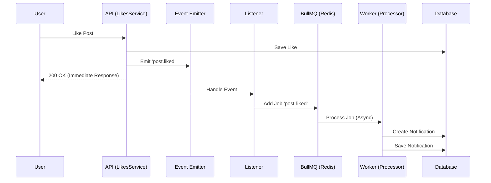

# Debook Social Content Interaction

A scalable, high-performance API for social interactions (likes) and asynchronous notifications, built with NestJS, PostgreSQL, and BullMQ.

## Features

- **High-Performance Counters**: Uses denormalized counters on posts for O(1) read performance.
- **Idempotency**: Prevents duplicate likes using unique database constraints and idempotent API design.
- **Async Notifications**: Decoupled notification system using BullMQ (Redis) and Event Emitters.
- **Clean Architecture**: Strict separation of concerns (Controller -> Service -> Repository).
- **Dockerized**: Complete environments for development and production.

## Prerequisites

- Node.js 18+
- Docker & Docker Compose

## Quick Start (Docker)

The easiest way to run the application is using Docker.

1.  **Start Services**:
    ```bash
    docker compose up -d --build
    ```
    This command will start the containers and run the database migrations automatically via the entrypoint script.

2.  **Verify**:
    The API will be running at `http://localhost:3000`.
    Swagger documentation available at `http://localhost:3000/api`.

## Local Development (Manual Setup)

If you prefer to run Node.js locally:

1.  **Start Database & Redis**:
    ```bash
    docker compose up -d postgres redis
    ```

2.  **Install Dependencies**:
    ```bash
    npm install
    ```

3.  **Run Migrations**:
    ```bash
    npm run db:create    # Ensure DB exists
    npm run migration:run
    ```

4.  **Start App**:
    ```bash
    npm run start:dev
    ```

## API Endpoints

### Posts
- `POST /v1/posts`: Create a new post.
- `GET /v1/posts`: Get all posts (paginated).
- `GET /v1/posts/:id`: Get a post by ID.

### Likes
- `POST /v1/posts/:postId/likes`: Like a post.
- `DELETE /v1/posts/:postId/likes`: Unlike a post.
- `GET /v1/posts/:postId/likes`: Get users who liked a post (paginated).

### Notifications
- `GET /v1/notifications`: Get user notifications (paginated).
- `PATCH /v1/notifications/:id/read`: Mark notification as read.
- `GET /v1/notifications/unread/count`: Get unread count.

Authentication is simulated via the `x-user-id` header.
Use the following seed user IDs for testing:
- Alice: `a0eebc99-9c0b-4ef8-bb6d-6bb9bd380a11`
- Bob: `b1eebc99-9c0b-4ef8-bb6d-6bb9bd380a12`

Detailed API documentation and interactive testing are available via Swagger at `http://localhost:3000/api`.

## Testing

**Unit Tests**:
```bash
npm run test
```

**E2E Tests**:
```bash
npm run test:e2e
```

## Architecture Decisions

- **Denormalized Counters**: Chosen to meet the "efficient queries" requirement. Avoids joining the `likes` table on every read.
- **TypeORM**: Used for robust migration support and entity management.
- **BullMQ**: Chosen for reliable, persistent background job processing (Notifications) that survives app restarts.

## Notification Flow

The notification system uses an asynchronous, event-driven architecture to decouple user actions from notification processing.



1.  **User Action**: User likes a post.
2.  **Synchronous**: Application updates database and returns success immediately.
3.  **Event**: `post.liked` event is emitted.
4.  **Queue**: Listener catches event and adds a job to BullMQ (Redis).
5.  **Processing**: Worker picks up job, creates notification record in DB.
